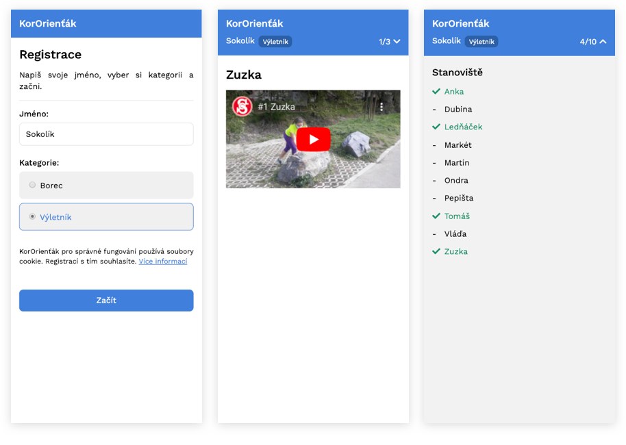

# KorOrienťák

V době, kdy jsou všechna cvičiště uzavřena, vznikl v [Sokole Libeň](http://www.sokol-liben.cz) nápad uspořádat bezkontaktní orientační běh, KorOrienťák. Na jednotlivých stanovištích jsou ukryté QR kódy, při jejichž načtení se změří čas závodníka a zobrazí úkol. Každý tak může závodit kdykoliv se mu to zrovna hodí.

## Jak to funguje

Nejprve se v administraci se nastaví nový závod a kategorie závodníků, ze kterých si mohou později závodníci při registraci vybrat. Pak se vytvoří úkoly pro jednotlivá stanoviště. Ty mohou být zadané pomocí textu, YouTube videa nebo obojího. Ke každému úkolu se vygeneruje QR kód, při jehož načtení se otevře stránka se zadáním úkolu. Jakmile jsou úkoly hotové, je možné všechny QR kódy vytisknout.

Závodníci začínají prvním úkolem, který je označený jako registrace. Zadají svoje jméno a vyberou si kategorii. Při registraci se vygeneruje unikátní identifikátor hráče, který se uloží do jeho prohlížeče.

Poté se závodníci vydávají ke stanovištím jednotlivých úkolů v pořadí podle jejich uvážení. Při načtení QR kódu se otevře stránka se zadáním úkolu a zároveň se uloží čas závodníka. (Pokud není zaregistrovaný, zobrazí se úkol společně s informací o závodě.)



Ve chvíli, kdy závodník navštívil alespoň jedno stanoviště, může načíst QR kód cíle. V ten moment se pro něj závod ukončí a pokud by načetl stanoviště dalšího úkolu, už se mu nebude počítat.

Závodníci vidí kolik stanovišť jim ještě zbývá navštívit a jejich seznam. Kategorie však mohou být označené jako závodní. V takovém případě si seznam a počet stanovišť závodník musí hlídat sám.

Všechny časy navštívených stanovišť jednotlivými hráči se ukládají, lze je ze systému exportovat jako CSV tabulku a poté vyhodnotit libovolným způsobem.

## Jak to spustím

Aplikaci je možné nasadit buď jako Django aplikaci přímo (viz [dokumentace](https://docs.djangoproject.com/en/3.0/howto/deployment/)) nebo je distribuovaná jako [Docker Image](https://hub.docker.com/repository/docker/janslifka/kororientak).

V produkčním módu aplikace používá databázi [PostgreSQL](https://www.postgresql.org).

### Konfigurace

Aplikace se konfigurje pomocí ENV proměnných:

| ENV | Popis |
|---|---|
| ADMIN_USER | Username admin účtu |
| ADMIN_PASS | Heslo admin účtu |
| SECRET_KEY | Náhodný řetězec |
| DB_NAME | Název databáze |
| DB_USER | Uživatel pro připojení do databáze |
| DB_PASS | Heslo pro připojení do databáze |
| DB_HOST | Server, kde běží databáze |
| DB_PORT | Port, na kterém běží databáze |
| PUBLIC_URL | URL, ze které je aplikace dostupná z internetu |
| APP_NAME | Název aplikace, výchozí "KorOrienťák" |

### Příklad

Příklad `docker-compose.yml` pro spuštění aplikace spolu s databází.

```yaml
version: '3'
services:
    kororientak:
        image: janslifka/kororientak
        ports:
            - 80:8000
        environment:
            ADMIN_USER: admin
            ADMIN_PASS: password
            SECRET_KEY: some_secret_key
            DB_NAME: kororientak
            DB_USER: user
            DB_PASS: password
            DB_HOST: postgres
            DB_PORT: 5432

    postgres:
        image: postgres
        environment:
            POSTGRES_PASSWORD: password
            POSTGRES_USER: user
            POSTGRES_DB: kororientak
```

**Upozornění:** při produkčním spuštění je vhodné, aby aplikace nebyla dostupná z internetu přímo, ale byla před ní nakonfigurovaná reverse proxy s https certifikátem.

## Development

Jedná se o klasický [Django](https://www.djangoproject.com) projekt. Po naklonovávní a vytvoření virtual envu je potřeba nainstalovat dev závislosti:

```
$ pip install -r requirements/dev.txt
```

Dále je potřeba vytvořit `.env` soubor v rootu projektu, např.:

```
SECRET_KEY=abcd
DEBUG=True
PUBLIC_URL=http://localhost:8000
```

Pak je možné vytvořit databázi a výchozího admin usera. Na to lze použít příkazy z Makefile:

```
$ make migrate
$ make create_admin
```

V debug módu se vytvoří sqlite databáze. Výchozí username je `admin` a heslo `password`.

Po provedení předchozích bodů už by mělo jít projekt lokálně spustit:

```
$ make run
```

A otevřít v prohlížeči [http://locahost:8000](http://locahost:8000).

V Makefilu je ještě několik příkazů na testování, code coverage a code style.

```
$ make test
$ make coverage
$ make codestyle
```

## Licence

Tento projekt je licencován pod licencí GNU AFFERO GENERAL PUBLIC LICENSE - další podrobnosti viz soubor [LICENSE](LICENSE).
